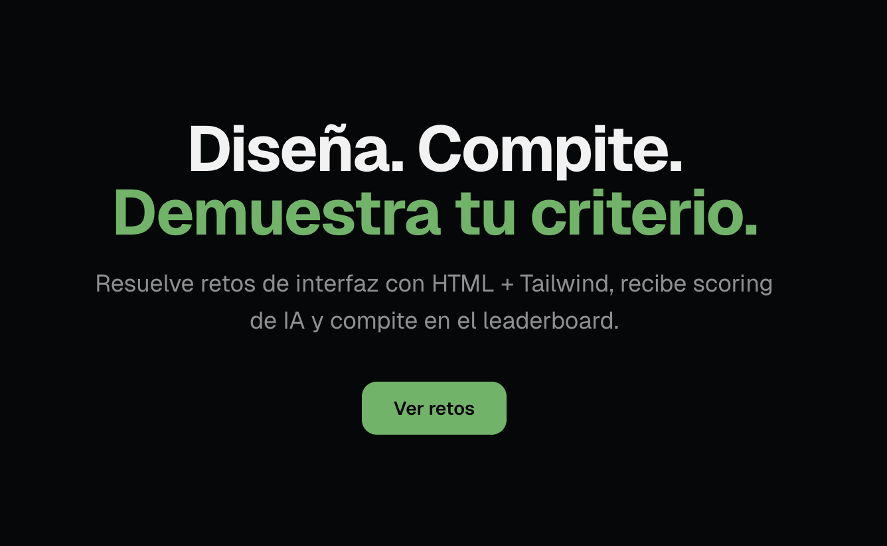
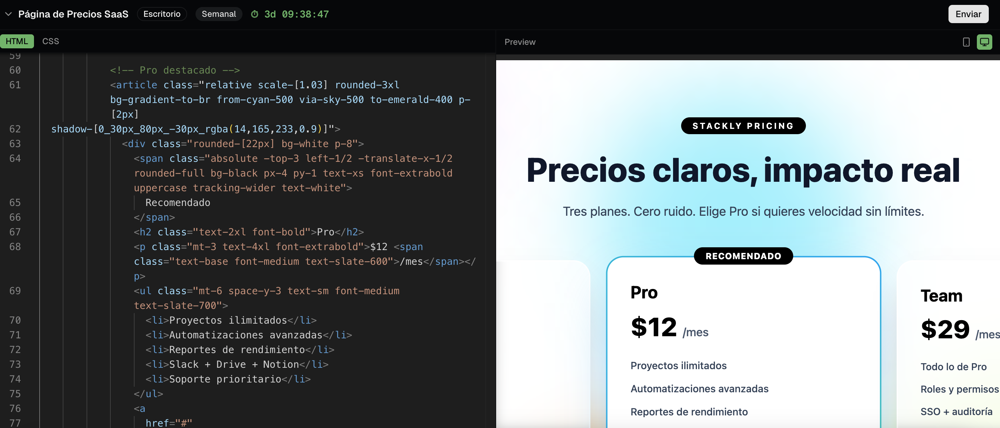
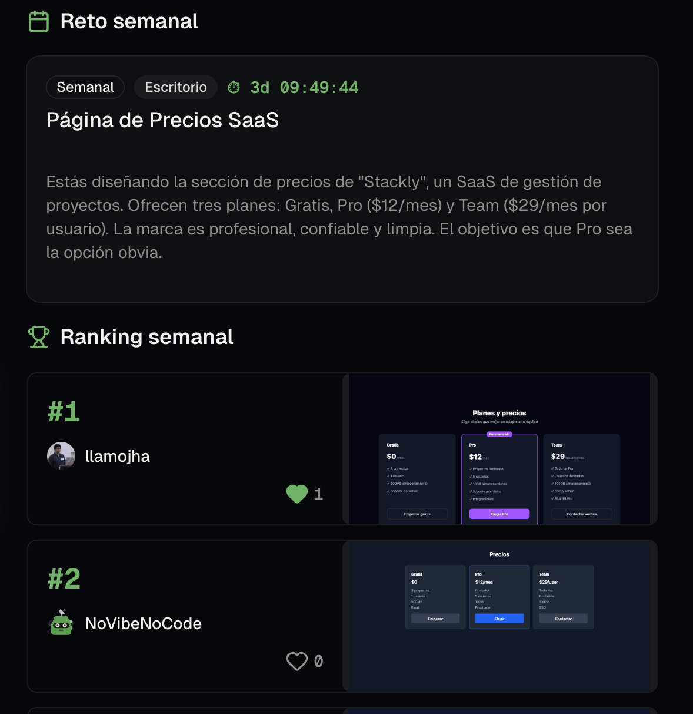
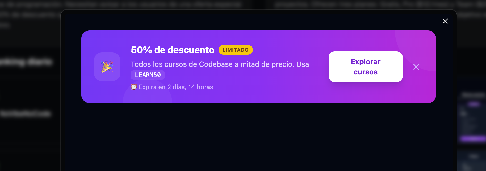

# ⚡ UX Clash

**La arena competitiva de UX/UI en código.**

Diseña interfaces con HTML + Tailwind para retos reales, compite en un leaderboard con scoring social y demuestra tu criterio de diseño.

🔗 **Demo:** [ux-clash.amllamojha.com](https://ux-clash.amllamojha.com/)

---

## ¿Qué es UX Clash?

UX Clash es una plataforma donde diseñadores y developers frontend resuelven retos de interfaz usando HTML + CSS/Tailwind en un editor en vivo. Cada reto tiene un escenario real (login de app, pricing page, dashboard…) y los participantes compiten por likes en un leaderboard público.

### Flujo principal

1. Elige un reto (diario o semanal)
2. Abre el editor con preview en tiempo real
3. Escribe HTML + CSS/Tailwind
4. Envía tu solución
5. Recibe likes de la comunidad
6. Sube en el leaderboard

## Screenshots

| Home | Editor |
|------|--------|
|  |  |

| Ranking | Preview Modal |
|---------|---------------|
|  |  |

## Stack técnico

| Capa | Tecnología |
|------|-----------|
| Framework | Next.js 16 (App Router, React 19) |
| Lenguaje | TypeScript (strict) |
| UI | shadcn/ui + Tailwind CSS v4 |
| Editor | Monaco Editor |
| Auth + DB | Supabase (PostgreSQL + GitHub OAuth) |
| Runtime | Bun |
| Deploy | CubePath VPS + Dokploy |

## CubePath

UX Clash corre en un **VPS de CubePath** ([cubepath.com](https://cubepath.com)), usando [Dokploy](https://dokploy.com/) como plataforma de despliegue:

- **Servidor:** VPS de CubePath con Dokploy instalado para gestionar servicios
- **App:** Next.js desplegado como servicio en Dokploy, conectado al repo de GitHub para auto-deploy en cada push a `main`
- **Build:** [Railpack](https://railpack.io/) — detección automática del stack y build optimizado sin Dockerfile
- **Dominio:** Dominio personalizado configurado a través de Dokploy con SSL automático

## Desarrollo local

```bash
# Clonar
git clone https://github.com/amllamojha/ux-clash.git
cd ux-clash

# Instalar
bun install

# Variables de entorno
cp .env.example .env.local
# Rellenar:
#   NEXT_PUBLIC_SUPABASE_URL=
#   NEXT_PUBLIC_SUPABASE_ANON_KEY=

# Ejecutar
bun dev
```

## Estructura del proyecto

```
src/
├── app/              # Páginas + API routes (Next.js App Router)
│   ├── api/          # Submissions, likes
│   ├── challenge/    # Detalle de reto
│   ├── challenges/   # Lista de retos
│   ├── editor/       # Editor de código (arena)
│   ├── leaderboard/  # Leaderboard global
│   └── submission/   # Página pública de submission
├── components/       # Componentes React (shadcn/ui + custom)
└── lib/              # Clientes Supabase, utils, sanitización
```

## Licencia

MIT
